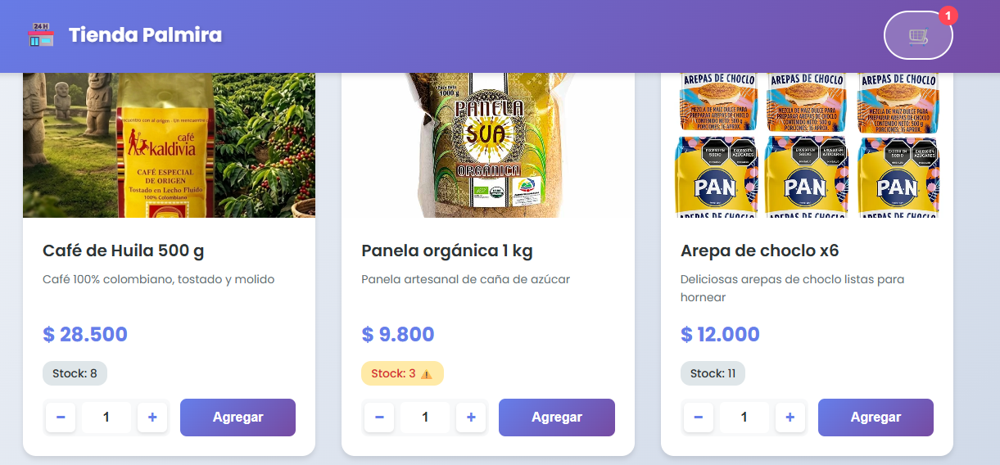
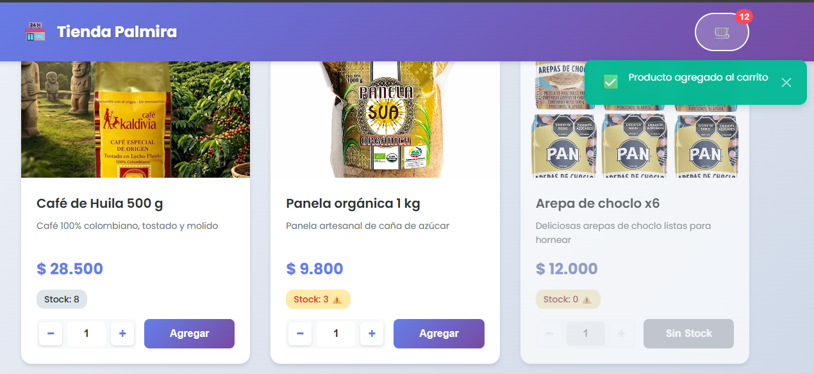
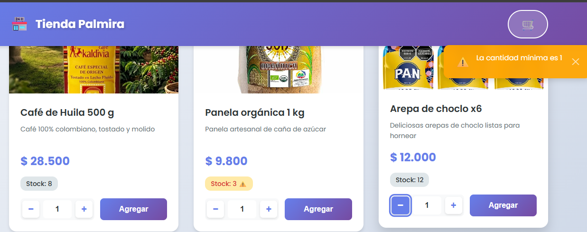
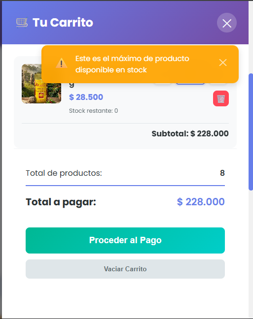
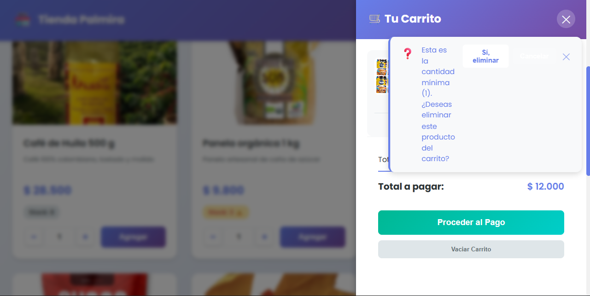
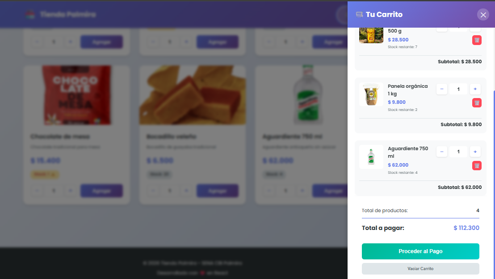
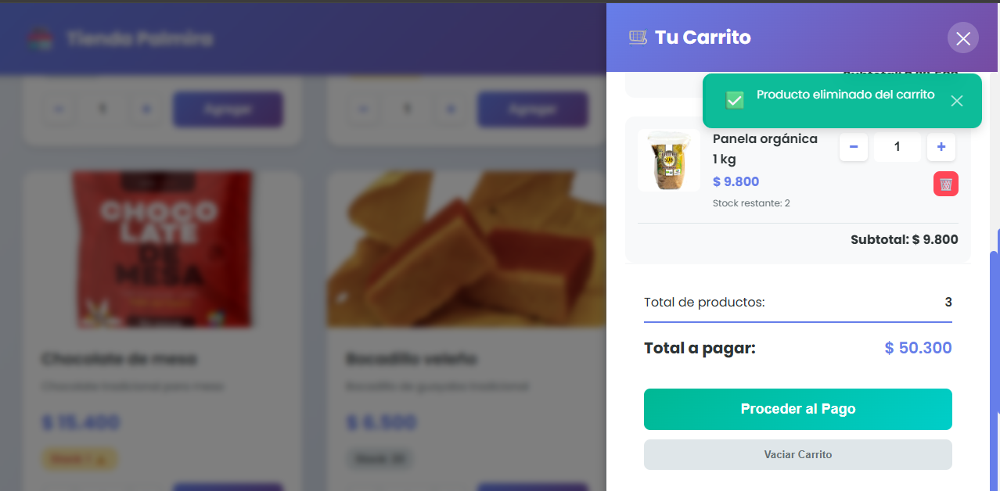

# 🛒 Tienda Palmira – Carrito de Compras con Validaciones de Stock

Reto práctico de **Desarrollo Front-End con React** – SENA, Centro de Biotecnología Industrial (CBI Palmira).

| | |
|---|---|
| **Aprendiz** | Johan Manuel Vasquez |
| **Ficha** | 3409924 |
| **Instructor** | Daniel Alfonso Martínez Payán |
| **Repositorio público** | [ENLACE DEL REPOSITORIO] |
| **Tecnología usada** | ☑ React (React 18 + Vite) ☐ HTML + CSS + JS |

## 📌 Descripción

Carrito de compras para la tienda virtual **TIENDA PALMIRA**, que vende productos típicos de la región. Resuelve las fallas del carrito anterior validando todo en el frontend: no se puede pedir más unidades de las que hay en bodega, ni cantidades negativas, en cero o con letras, y los totales se actualizan correctamente cuando un mismo producto se agrega varias veces. Cada acción no permitida se informa con **toasts** (sin `alert()` del navegador).

## ✨ Funcionalidades

- **Catálogo** desde un array JSON en el frontend (`src/data/productos.json`), sin base de datos ni API.
- **Navbar fija** con el nombre de la tienda a la izquierda y el ícono del carrito a la derecha, con contador de unidades (se oculta si es 0).
- **Carrito** como panel lateral que se abre con el ícono y se cierra con la X o haciendo clic fuera.
- **Agregar sin duplicar líneas:** si el producto ya está en el carrito, se suma la cantidad.
- **Botón Agregar deshabilitado** cuando no quedan unidades disponibles.
- **Campo de cantidad validado** (componente reutilizable `QuantityInput`).
- **Stock máximo con toast:** al escribir, al pulsar `+` y al agregar de nuevo.
- **Cantidad mínima con toast de confirmación** para eliminar el producto, más botón para quitarlo directamente.
- **Subtotales por línea, total de la compra y total de unidades** con formato de moneda COP.
- **Toasts** que desaparecen solos y se pueden cerrar manualmente.
- **Extras:** carrito guardado en `localStorage` (se valida contra el stock al cargar), búsqueda de productos y filtro "Solo disponibles".

## ✅ Validaciones del campo de cantidad

- No permite letras, en especial `e` / `E`.
- No permite `+`, `-`, punto ni coma: solo enteros positivos.
- No permite `0` ni negativos.
- Al pegar texto, solo se acepta si son únicamente dígitos.
- La rueda del mouse no cambia el valor.
- Arrastrar y soltar texto en el campo está bloqueado.
- Si el campo queda vacío al salir, se restaura el último valor válido.

## 💬 Mensajes (toasts)

| Situación | Mensaje |
|---|---|
| Se intenta superar el stock | "Este es el máximo de producto disponible en stock" |
| Escribir 0 en la tarjeta del producto | "La cantidad mínima es 1" |
| Cantidad 1 en el carrito y se pulsa `−` o se escribe 0 | "Esta es la cantidad mínima (1). ¿Deseas eliminar este producto del carrito?" + botones **Sí, eliminar** / **Cancelar** |

## 🚀 Instalación y ejecución

Requisitos: [Node.js](https://nodejs.org) (versión LTS) y Git.

```bash
git clone [ENLACE DEL REPOSITORIO]
cd [NOMBRE DE LA CARPETA]
npm install
npm run dev
```

La aplicación abre en `http://localhost:3000`.

Para generar la versión de producción: `npm run build`.

## 📁 Estructura del proyecto

```
├── evidencias/              Capturas de pantalla de las funcionalidades
├── public/
├── src/
│   ├── components/          Navbar, ProductCard, QuantityInput, Cart, Toast, ToastContainer
│   ├── constants/           messages.js (textos de los toasts)
│   ├── context/             CartContext.jsx, ToastContext.jsx
│   ├── data/                productos.json (catálogo)
│   ├── utils/               validators.js (validaciones y formato COP)
│   ├── App.jsx
│   └── index.jsx
├── index.html
├── package.json
└── vite.config.js
```

## 🧪 Casos de prueba del instructor

| # | Acción | Resultado |
|---|---|---|
| 1 | Teclear `e`, `E`, `+`, `-`, `.` o `,` en un campo de cantidad | ☑ No escribe nada |
| 2 | Pegar `-5`, `3e2` o `abc` | ☑ No se pega |
| 3 | Escribir `0` en la tarjeta del producto | ☑ Conserva el valor y muestra toast de mínimo 1 |
| 4 | Escribir `0` en el carrito | ☑ No cambia y muestra toast con opción de eliminar |
| 5 | Escribir `999` en un producto con stock 8 | ☑ Se corrige a 8 y muestra toast de máximo |
| 6 | Panela (stock 3): agregar 2 y luego 2 más | ☑ Queda en 3 y muestra toast de máximo |
| 7 | En el carrito, `+` con cantidad igual al stock | ☑ No sube y muestra toast de máximo |
| 8 | En el carrito, `−` con cantidad 1 | ☑ Toast de mínimo; al confirmar se elimina y se recalcula el total |
| 9 | Agregar dos veces el mismo producto | ☑ Una sola línea con cantidades sumadas |
| 10 | Café ×2, Panela ×3 y Arepa ×1 | ☑ $57.000, $29.400 y $12.000; total **$98.400** |
| 11 | Agregar todo el stock de un producto | ☑ El botón Agregar queda deshabilitado |
| 12 | Observar la barra de navegación | ☑ Ícono a la derecha con contador de unidades |

> Marca ☑ solo los casos que verificaste tú mismo; si alguno falla, cámbialo a ☐.

## 📸 Evidencias

| # | Funcionalidad | Captura | ¿Funciona? |
|---|---|---|---|
| 1 | Navbar e ícono con contador | `evidencias/01-navbar-contador.png` | Sí |
| 2 | Agregar producto desde el catálogo | `evidencias/02-agregar-producto.png` | Sí |
| 3 | Bloqueo de la tecla "e" y de negativos / 0 | `evidencias/03-bloqueo-e-negativos-cero.png` | Sí |
| 4 | Toast de stock máximo | `evidencias/04-toast-stock-maximo.png` | Sí |
| 5 | Toast de cantidad mínima con opción de eliminar | `evidencias/05-toast-minimo-eliminar.png` | Sí |
| 6 | Subtotales y total con varios productos | `evidencias/06-subtotales-total.png` | Sí |
| 7 | Producto eliminado y total recalculado | `evidencias/07-producto-eliminado.png` | Sí |









---
SENA – Servicio Nacional de Aprendizaje · CBI Palmira · Desarrollo Front-End con React
